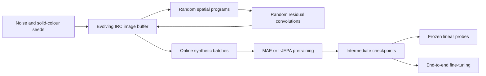

# Universal Pretraining for Images

Can useful visual representations emerge from synthetic images generated by a simple iterative mechanism, without learning the generator from a curated image dataset?

This repository investigates **Iterated Random Computation (IRC)** as a mechanism for producing a broad, continuously evolving visual pretraining distribution. Instead of storing a fixed synthetic dataset, IRC repeatedly transforms and recombines a population of images using randomly sampled spatial programs and randomly initialized residual convolutions. Vision Transformers are trained online on this distribution using either a **Masked Autoencoder (MAE)** or an **Image-based Joint-Embedding Predictive Architecture (I-JEPA)** objective. The central hypothesis is that iteration and composition can make useful visual structure emerge from simple random processes, producing representations that transfer consistently across substantially different downstream domains.

In this project, “universal” is an empirical goal rather than a mathematical claim: a distribution is considered more universal when it supports broad and consistent transfer across objects, scenes, textures, remote sensing, fine-grained recognition, and synthetic diagnostic tasks.

## Research questions

The project is organized around three questions:

1. Can iterated random computations produce a richer pretraining distribution than independent or hand-designed noise processes?
2. Do representations learned from IRC transfer consistently across different visual domains instead of specializing in one dataset family?
3. Does the effect persist across two distinct self-supervised objectives: pixel reconstruction with MAE and latent prediction with I-JEPA?

The strongest evidence for the hypothesis is an improvement distributed across multiple task types, rather than an isolated gain on a single benchmark.

## Experimental design



The generator is the principal experimental variable. The learner architecture, training budget, checkpoint schedule, and evaluation protocol are kept as consistent as possible so that IRC can be compared with controlled baselines.

## Synthetic pretraining distributions

Pretraining images are generated on demand and are not stored as a conventional dataset.

| Generator | Role | Description |
|---|---|---|
| `irc_new` | Current primary method | A depth-aware IRC implementation with a 40,000-image evolving buffer. It prioritizes sufficiently transformed samples while continuing to inject fresh noise and colours. |
| `irc` | Original IRC implementation | Maintains a 20,000-image buffer and repeatedly updates selected images with random spatial programs and residual convolutions. |
| `gaussian_blurred_noise` | Local-correlation baseline | Uniform pixel noise filtered with a separable Gaussian kernel. |
| `spectrum` | Frequency-statistics baseline | Random images whose Fourier magnitudes follow sampled power-law spectra. |
| `styleGAN-random` | Architectural-prior baseline | An untrained, randomly initialized StyleGAN2-like synthesis network. |
| `real_video` | Real-image reference | Deterministic random crops from a supplied video, without a curated semantic image dataset. |

### Iterated Random Computation

IRC starts from a buffer containing pixel-noise images and solid RGB images. During an update:

1. A small part of the buffer is reset to fresh pixel noise or solid colours.
2. Source and partner images are sampled from the buffer.
3. A short random spatial program is applied. Its operations include:

   - crop and resize;
   - spatial blur;
   - connected block crossover between two images;
   - identity.

4. A freshly initialized residual convolutional network mutates the result with a bounded pixel-level change.
5. The transformed images replace their sources in the buffer.
6. A training batch is sampled from the updated population.

Identity has probability `1/2`, while crop-resize, blur, and block crossover each have probability `1/6`. A program stops with probability `1/2` after every operation, giving an expected length of two operations.

The current `irc_new` variant additionally records each image’s transformation depth. It samples training examples above an adaptive minimum-depth threshold, while resets and per-program source replacement keep fresh low-level variation in the population.

## Self-supervised learning objectives

### Masked Autoencoder

The MAE path follows the asymmetric encoder-decoder design of masked autoencoders:

- Images are split into non-overlapping `16 × 16` patches.
- `75%` of patches are removed before the encoder.
- The ViT encoder processes only the visible patches.
- A lightweight decoder reconstructs the missing pixels.
- Reconstruction loss is computed only on masked patches.
- The decoder is discarded for downstream classification.

The default ViT-Tiny configuration uses a 192-dimensional encoder with 12 transformer blocks and 3 attention heads. The Tiny decoder has hidden size 128, 2 transformer blocks, and 4 heads. Fixed two-dimensional sine-cosine positional embeddings are used.

MAE configurations for Tiny, Small, Base, and Large encoders are included for pretraining. The current fine-tuning configuration is provided for ViT-Tiny.

### I-JEPA

The I-JEPA path predicts target-region representations rather than pixels. It contains:

- an online context encoder;
- an exponential-moving-average target encoder;
- a predictor that maps encoded context tokens to target-block representations;
- a multi-block masking strategy with a large context region and several smaller target regions.

The current Tiny configuration uses the same 192-dimensional, 12-block, 3-head encoder scale as MAE. Its predictor has hidden size 128, 6 transformer blocks, and 4 heads. Four target blocks are sampled per image, and Smooth L1 loss compares predicted representations with stop-gradient target-encoder representations.

I-JEPA has no class token in this implementation. Downstream evaluation mean-pools all patch tokens, and the EMA target encoder is used for linear probing and as the initialization for fine-tuning.

## Default large-scale configurations

| Setting | MAE Tiny | I-JEPA Tiny |
|---|---:|---:|
| Input resolution | `224 × 224` | `224 × 224` |
| Patch size | `16 × 16` | `16 × 16` |
| Encoder hidden size | 192 | 192 |
| Encoder blocks | 12 | 12 |
| Attention heads | 3 | 3 |
| Current generator | `irc_new` | `irc_new` |
| Effective training batch | 4,000 | 4,002 |
| Pretraining budget | 100,000,000 images | 100,050,000 images |
| Checkpoint interval | 4,000,000 images | 4,002,000 images |

These are expensive research configurations. Reduce the image budget and batch sizes in the YAML files for development checks.

## Evaluation protocol

### Frozen linear probing

Intermediate pretraining checkpoints are evaluated by freezing the encoder and training only a small classifier:

1. Extract one representation per image by averaging patch tokens.
2. Cache train and test features on the GPU.
3. Train an affine-free BatchNorm plus linear classifier for 100 epochs.
4. Use SGD with learning rate `0.1`, momentum `0.9`, a 10-epoch warm-up, and cosine decay.
5. Report classification accuracy without updating the encoder.

MAE evaluation also measures masked reconstruction loss on held-out real images. I-JEPA evaluation reports linear-probe accuracy only because it predicts representations rather than pixels.

The configured validation datasets are:

- CIFAR-10
- Describable Textures Dataset
- EuroSAT
- Food-101
- Oxford-IIIT Pets
- Tiny ImageNet-200
- line-field orientation
- shape-colour objects
- texture mosaic

The configured held-out test group is:

- CIFAR-100
- RESISC45
- Stanford Cars
- SUN397 partition 1

These probes are intended primarily for controlled comparison and checkpoint selection within this project. Some dataset splits differ from complete published benchmark protocols, so their values should not be treated as directly comparable leaderboard results.

### End-to-end fine-tuning

Both MAE and I-JEPA support full-encoder fine-tuning on an `ImageFolder` classification dataset. The implemented recipe includes:

- global average pooling of patch tokens and a newly initialized linear head;
- stochastic depth with maximum drop-path rate `0.1`;
- layer-wise learning-rate decay;
- AdamW with fused CUDA kernels;
- a 5-epoch warm-up followed by cosine decay;
- ImageNet normalization;
- random resized crops and horizontal flips;
- a DeiT-style RandAugment policy;
- Mixup, CutMix, label smoothing, and random erasing;
- bfloat16 automatic mixed precision.

I-JEPA fine-tuning loads the EMA target encoder and discards the predictor. MAE fine-tuning loads only the pretrained encoder and discards the reconstruction decoder.

Synthetic pretraining uses raw inputs in `[0, 1]`, whereas fine-tuning uses ImageNet normalization. When a pretrained checkpoint is loaded, the patch-projection weights and bias are adapted so that the initial patch embeddings remain equivalent under the normalized input parameterization.

## Repository structure

```text
Code/
└── src/
    ├── run.py
    ├── models.py
    ├── models_util.py
    ├── util.py
    ├── generators/
    │   ├── irc.py
    │   ├── irc_new.py
    │   ├── gaussian_blurred_noise.py
    │   ├── spectrum.py
    │   ├── styleGAN_random.py
    │   ├── real_video.py
    │   └── test.py
    └── experiments/
        ├── evaluation_util.py
        ├── MAE/
        │   ├── pretraining/
        │   │   ├── main.py
        │   │   ├── evaluation.py
        │   │   └── configs/
        │   └── fine_tuning/
        │       ├── main.py
        │       ├── evaluation.py
        │       ├── data_transforms.py
        │       └── configs/
        └── I_JEPA/
            ├── pretraining/
            │   ├── main.py
            │   ├── masking.py
            │   ├── evaluation.py
            │   └── configs/
            └── fine_tuning/
                ├── main.py
                ├── evaluation.py
                └── configs/
```

Runtime directories such as `Code/checkpoints`, `Code/datasets`, and `Code/eval_results` are created or populated locally and are not part of the source tree.

## Requirements

The training code is CUDA-first and currently has no CPU training path. It uses bfloat16 autocasting, fused AdamW, CUDA streams, and `torch.compile`, so an NVIDIA GPU and a recent CUDA-compatible PyTorch installation are required.

Core Python dependencies are:

- PyTorch
- torchvision
- NumPy
- PyYAML
- Weights & Biases
- Pillow
- OpenCV, when using the real-video generator

Dependency versions are not pinned. Install the CUDA builds of PyTorch and torchvision appropriate for the target driver from the [official PyTorch installation guide](https://pytorch.org/get-started/locally/), then install the remaining packages:

```bash
python -m venv .venv
source .venv/bin/activate

python -m pip install --upgrade pip
python -m pip install numpy pyyaml wandb pillow opencv-python
```

On Windows, activate the environment with:

```powershell
.venv\Scripts\Activate.ps1
```

Authenticate Weights & Biases before starting an experiment:

```bash
wandb login
```

Training logs to the `universal-pretraining-for-images` W&B project.

## Dataset layout

Evaluation datasets must follow the torchvision `ImageFolder` convention:

```text
Code/datasets/
└── <dataset-name>/
    ├── train/
    │   ├── <class-1>/
    │   └── <class-2>/
    └── test/
        ├── <class-1>/
        └── <class-2>/
```

Fine-tuning training can read from another dataset root by setting `DATASETS_DIR`:

```bash
export DATASETS_DIR=/path/to/datasets
```

The fine-tuning evaluator currently reads from `Code/datasets/<dataset>/test`, so an external evaluation set should be linked or copied into that layout.

The real-video baseline expects a 640 × 360 video at:

```text
Code/datasets/video/Walking_in_Amsterdam_640x360_30fps.mp4
```

## Configuration

Experiment settings are stored in YAML files under:

```text
Code/src/experiments/<MAE-or-I_JEPA>/<stage>/configs/
```

The dispatcher currently selects the model size through the `size` variable near the top of `Code/src/run.py`; its default is `tiny`. Generator choice, model architecture, masking, optimization, image budget, and checkpoint frequency are controlled by the corresponding YAML file.

The main command-line options are:

```text
--experiment                  MAE or I_JEPA
--mode                        pretraining_main, pretraining_evaluation,
                              fine_tuning_main, or fine_tuning_evaluation
--checkpoint_path             checkpoint to resume or evaluate
--fine_tuning_dataset         ImageFolder dataset name
--fine_tuning_layer_decay     optional YAML override
--pretraining_checkpoint_path pretrained encoder checkpoint for fine-tuning
```

Relative checkpoint paths are resolved under `Code/checkpoints`.

## Running experiments

Run commands from the repository root.

### MAE pretraining

```bash
python Code/src/run.py \
  --experiment MAE \
  --mode pretraining_main
```

### I-JEPA pretraining

```bash
python Code/src/run.py \
  --experiment I_JEPA \
  --mode pretraining_main
```

I-JEPA pretraining enables DistributedDataParallel when launched in a Slurm allocation with `SLURM_NTASKS > 1`; rank and local-device information are read from `SLURM_PROCID` and `SLURM_LOCALID`. The other training paths currently run as single processes.

### Resume pretraining

```bash
python Code/src/run.py \
  --experiment I_JEPA \
  --mode pretraining_main \
  --checkpoint_path ijepa_model_tiny_generator_irc_new_images_seen_4002000.pth
```

Keep the matching `_resume.pth` file beside the model checkpoint when an exact continuation is required.

### Evaluate a pretraining checkpoint

```bash
python Code/src/run.py \
  --experiment I_JEPA \
  --mode pretraining_evaluation \
  --checkpoint_path ijepa_model_tiny_generator_irc_new_images_seen_4002000.pth
```

For MAE:

```bash
python Code/src/run.py \
  --experiment MAE \
  --mode pretraining_evaluation \
  --checkpoint_path model_tiny_generator_irc_new_images_seen_4000000.pth
```

The evaluation YAML chooses the dataset group, metric namespace, batch sizes, and result suffix.

> **Checkpoint retention:** the supplied evaluation configurations set `delete_checkpoints_after_evaluation: true`. Intermediate checkpoints are deleted after successful evaluation except for explicitly protected initial and final checkpoints. Change this option before evaluation if all checkpoints must be retained.

### Fine-tune a pretrained encoder

```bash
python Code/src/run.py \
  --experiment I_JEPA \
  --mode fine_tuning_main \
  --fine_tuning_dataset imagenet1k-simclr-10pct \
  --pretraining_checkpoint_path ijepa_model_tiny_generator_irc_new_images_seen_100050000.pth
```

The same interface is available for MAE:

```bash
python Code/src/run.py \
  --experiment MAE \
  --mode fine_tuning_main \
  --fine_tuning_dataset imagenet1k-simclr-10pct \
  --pretraining_checkpoint_path model_tiny_generator_irc_new_images_seen_100000000.pth
```

Fine-tuning compilation can be disabled for debugging:

```bash
DISABLE_COMPILE=1 python Code/src/run.py \
  --experiment I_JEPA \
  --mode fine_tuning_main \
  --fine_tuning_dataset <dataset-name> \
  --pretraining_checkpoint_path <checkpoint-name>
```

### Evaluate a fine-tuned checkpoint

```bash
python Code/src/run.py \
  --experiment I_JEPA \
  --mode fine_tuning_evaluation \
  --checkpoint_path <fine-tuned-checkpoint>.pth
```

## Checkpoints and experiment tracking

Every saved training state is split into two files:

- The main checkpoint contains model weights, configuration, progress metadata, and the W&B run ID.
- The matching `_resume.pth` file contains optimizer state, random-number-generator states, and, for IRC pretraining, the evolving generator buffer and depth metadata.

Checkpoint files are written through temporary files and atomically renamed only after serialization completes.

Naming conventions are:

```text
model_<size>_generator_<generator>_images_seen_<N>.pth
ijepa_model_<size>_generator_<generator>_images_seen_<N>.pth
fine_tuned_<pretraining-checkpoint>_<dataset>_layer_decay_<rate>_epoch_<N>.pth
```

Evaluation metrics are written atomically as JSON files under `Code/eval_results`. Training metrics and generator snapshots are logged directly to Weights & Biases.

## Reproducibility

The implementation uses seed `1729` for Python, NumPy, PyTorch, and CUDA. Checkpoints preserve:

- the complete experiment configuration;
- optimizer state;
- Python, NumPy, CPU, and CUDA random states;
- IRC buffer contents;
- IRC transformation depths for `irc_new`;
- training progress and W&B identity.

This supports exact continuation of the experiment state when both checkpoint files are available. A fixed seed does not guarantee bitwise identity across different GPU architectures, CUDA versions, PyTorch versions, compiler backends, or distributed launch configurations.

## Current limitations

- Training assumes CUDA and uses hardware-specific features such as bfloat16 and fused AdamW.
- Datasets, generated checkpoints, and the real-video asset are not distributed with the source code.
- The default 100-million-image configurations require substantial compute and are not intended as smoke tests.
- I-JEPA configurations currently target ViT-Tiny; MAE pretraining also includes Small, Base, and Large configurations.
- Fine-tuning configurations are currently provided for ViT-Tiny.
- Slurm-aware multi-GPU execution is implemented for I-JEPA pretraining, while the remaining pipelines are single-process.
- Dataset versions and package versions must be recorded externally for fully repeatable runs.
- Evaluation scores are best interpreted as controlled comparisons within this project because not every local split matches a complete published benchmark protocol.

## References

- Kaiming He et al., [Masked Autoencoders Are Scalable Vision Learners](https://arxiv.org/abs/2111.06377), CVPR 2022.
- Mahmoud Assran et al., [Self-Supervised Learning from Images with a Joint-Embedding Predictive Architecture](https://arxiv.org/abs/2301.08243), CVPR 2023.
- Manel Baradad et al., [Learning to See by Looking at Noise](https://arxiv.org/abs/2106.05963), NeurIPS 2021.
